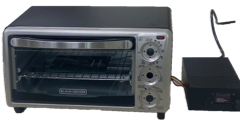
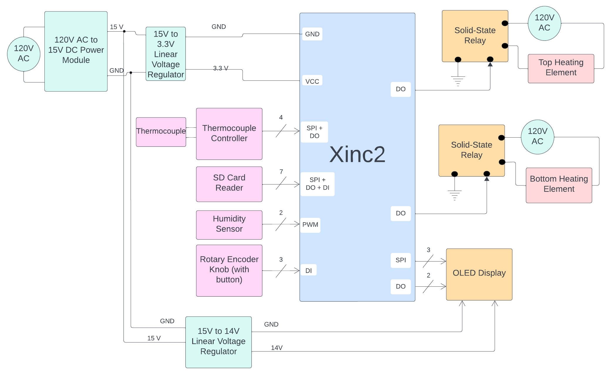
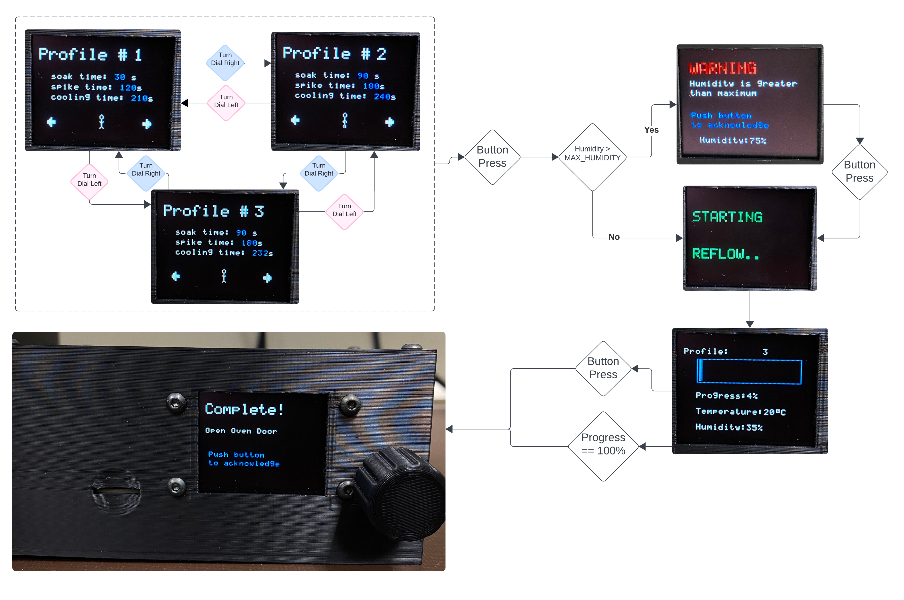
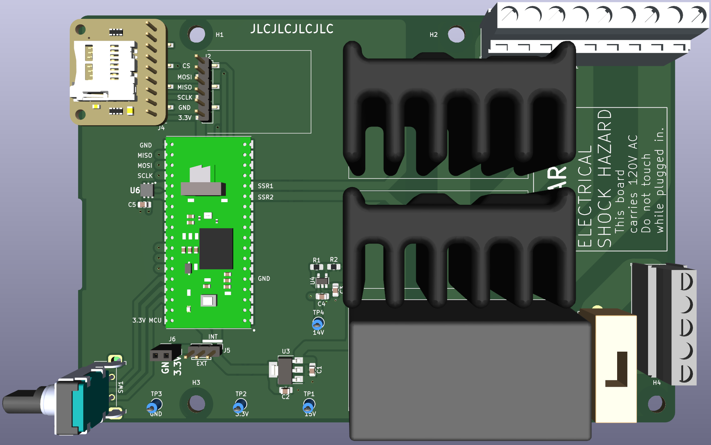
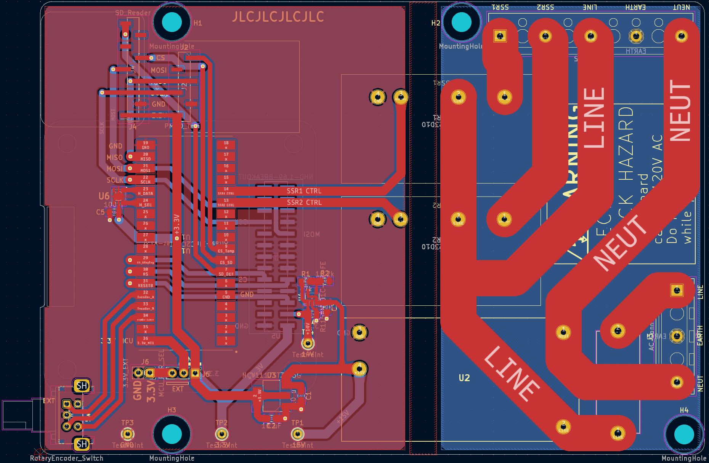
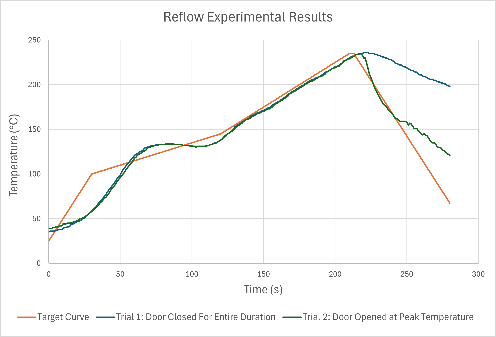

# ReflowOvenController

Capstone project for Electrical Engineering at U of A

_By: Connor Chin, Tait Richards, Megan Veldhuis, Mia Vukadin_

## Overview

The Reflow Oven Controller will be controlled using a XInC2 Microcontroller from Eleven Engineering. The reflow oven was designed and built using an old microwave oven and a new heater, thermocouple, OLED, humidity sensor, and rotary encoder. We designed a custom PID controller to follow the reflow curve with a 5% accuracy. Each solder paste has a different melting temperature, and thus require a different reflow curve, so we designed three different profiles with three different reflow curves that the user can choose from before starting the process. Below is the block diagram for the project.

## Goals

- [ ] maintain 250 °C for over 90 seconds
- [ ] multiple temperature profile options that had 4 temperature zones
- [ ] humidity sensor with an accuracy within 5% RH
- [ ] utilized the XInC2 MCU
- [ ] had a power consumption well under 1600W
- [ ] follow the target temperature curve to within ±10°C after initial ramp heating

## Firmware

This repository contains all of the firmware used in this project. Below is a flowchart of the UI

## Hardware

### Designed PCB

## Conclusion

The final product successfully monitored and displayed the temperature inside the Reflow Oven! During our presentation, our demo successfully soldered a PCB.

Revisiting our Goals:

- [x] maintain 250 °C for over 90 seconds
- [x] multiple temperature profile options that had 4 temperature zones
- [x] humidity sensor with an accuracy within 5% RH
- [x] utilized the XInC2 MCU
- [x] had a power consumption well under 1600W
- [x] follow the target temperature curve to within ±10°C after initial ramp heating

